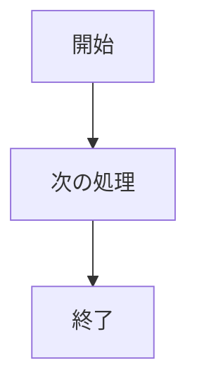
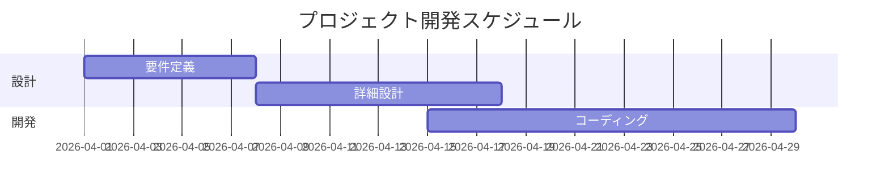
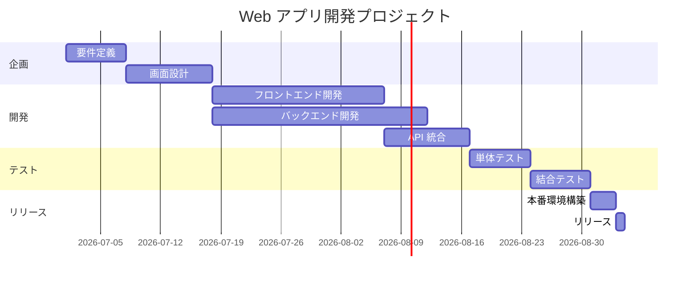

## 業務フローは美しく

- github pagesとすったもんだとしてaiに助けてもらってやっと種々の業務フローがダイヤグラムとしてだせるようになりました。今後はこれをもとにきれいな図表を用意したいと考えてます。

こんな簡単なのなら1，2分でサクッと書ける  
下のガントチャートも数行の文字列の文書から書けるのでうれしい

ちょっと大きめのシステムの開発スケジュールも15行くらいでサクッと書けますね。

